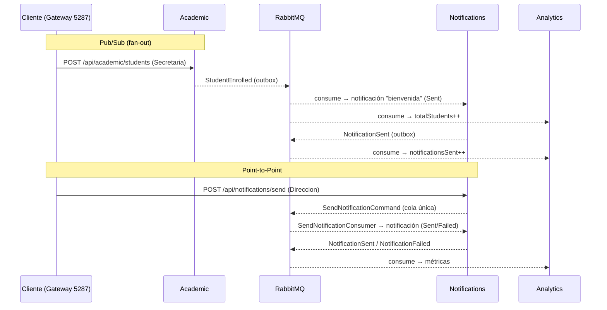

# Notifications & Analytics — Documentación de servicios

> Bounded contexts finales de CampusConnect 360. Cierran los dos patrones de mensajería exigidos
> por la consigna: **Publish/Subscribe** (fan-out de eventos) y **Point-to-Point** (comando a una
> sola cola), más una **vista analítica CQRS** (read model).

Última actualización: 2026-06-21

---

## 0. Escenario funcional obligatorio (consigna)

El ecosistema debe cubrir al menos los siguientes procesos:

### 5.1 Registro de estudiante y matrícula

Cuando Secretaría Académica registra un nuevo estudiante:

1. El usuario ingresa al portal académico.
2. Registra los datos del estudiante.
3. Crea o confirma la matrícula.
4. El sistema académico guarda la información.
5. Se publica el evento `StudentEnrolled`.
6. El sistema de notificaciones recibe el evento y registra una notificación simulada.
7. El sistema de analítica recibe el evento y actualiza sus indicadores.

### 5.2 Confirmación de pago

Cuando el área financiera confirma un pago:

1. El usuario ingresa al portal financiero.
2. Consulta estudiantes con pagos pendientes.
3. Confirma el pago de un estudiante.
4. El sistema de pagos registra la transacción.
5. Se publica el evento `PaymentConfirmed`.
6. El sistema académico actualiza el estado financiero del estudiante.
7. El sistema de notificaciones genera una notificación simulada.
8. El sistema de analítica actualiza los indicadores financieros.

### 5.3 Registro de asistencia o incidente

Cuando un docente o responsable de bienestar registra información del estudiante:

1. El usuario ingresa al portal docente o de bienestar.
2. Consulta estudiantes registrados.
3. Registra asistencia, ausencia o incidente.
4. El sistema correspondiente guarda la información.
5. Se publica el evento `AttendanceRecorded` o `IncidentReported`.
6. El sistema de notificaciones genera una alerta simulada cuando aplique.
7. El sistema de analítica actualiza los indicadores correspondientes.

### 5.4 Dashboard directivo

La solución debe incluir un dashboard o vista directiva que permita consultar información consolidada del ecosistema.

El dashboard debe mostrar, como mínimo:

- Total de estudiantes matriculados.
- Pagos confirmados.
- Pagos pendientes.
- Asistencias registradas.
- Incidentes reportados.
- Eventos procesados.
- Errores o mensajes fallidos.
- Estado general del ecosistema.

### Cumplimiento

| Requisito                                                           | Notifications                          | Analytics                                                                  |
| ------------------------------------------------------------------- | -------------------------------------- | -------------------------------------------------------------------------- |
| **5.1** `StudentEnrolled` → notificación + indicadores              | `StudentEnrolledConsumer` (bienvenida) | `StudentEnrolledConsumer` (`totalStudents++`)                              |
| **5.2** `PaymentConfirmed` → notificación + indicadores financieros | `PaymentConfirmedConsumer`             | `PaymentConfirmedConsumer` (`paymentsConfirmed++`, baja `paymentsPending`) |
| **5.3** `AttendanceRecorded` → alerta si Absent/Late + indicadores  | `AttendanceRecordedConsumer`           | `AttendanceRecordedConsumer` (`attendanceRecorded++`)                      |
| **5.3** `IncidentReported` → alerta + indicadores                   | `IncidentReportedConsumer`             | `IncidentReportedConsumer` (`incidentsReported++`)                         |
| **5.4** Dashboard con todos los indicadores mínimos                 | —                                      | `GET /api/analytics/dashboard`                                             |

`DashboardDto` cubre los 8 indicadores exigidos: `totalStudents`, `paymentsConfirmed`, `paymentsPending`, `attendanceRecorded`, `incidentsReported`, `eventsProcessed`, `failedMessages`, `status` (`ok`/`degraded`).

---

## 1. Resumen

| Servicio      | Puerto local | Prefijo Gateway      | DB                 | Rol patrón                                           |
| ------------- | ------------ | -------------------- | ------------------ | ---------------------------------------------------- |
| Notifications | 5185         | `/api/notifications` | `notifications_db` | Pub/Sub **consumidor** + Point-to-Point **receptor** |
| Analytics     | 5247         | `/api/analytics`     | `analytics_db`     | Pub/Sub **consumidor** (read model CQRS)             |

Ambos siguen la misma Clean Architecture que el resto (`Domain → Application → Infrastructure → API`),
con MediatR + `Result<T>`, MassTransit + RabbitMQ (outbox EF), EF Core + Npgsql (Postgres único en
`localhost:5438`), JWT Bearer y OpenAPI nativo de .NET 10.

Todas las llamadas pasan por el **Gateway Ocelot** (`http://localhost:5287` en local). Las rutas de
negocio requieren `Authorization: Bearer <jwt>`; las rutas `/health` son públicas.

---

## 2. Notifications

### 2.1 Propósito

Centraliza el envío (simulado) de notificaciones a los acudientes. Reacciona a eventos del resto de
servicios y también acepta envíos ad-hoc directos. Cada notificación se persiste con su estado final
(`Sent` o `Failed`) y publica un evento de resultado que Analytics consume.

### 2.2 Dominio

- `Notification` (AggregateRoot, id `NotificationId` = ULID).
- `NotificationChannel`: `Email` | `Sms` | `Push`.
- `NotificationStatus`: `Sent` | `Failed`.
- Fábricas: `CreateSent(...)` (canal válido + destinatario presente) y `CreateFailed(...)` (motivo).

### 2.3 Patrón Publish/Subscribe (consumidores)

Cada consumidor es un adaptador delgado que traduce un evento de integración en un
`RegisterNotificationCommand` (MediatR). El handler crea la `Notification` y publica el evento de
resultado vía outbox.

| Evento consumido          | Origen               | Cola RabbitMQ                       | Comportamiento                                          |
| ------------------------- | -------------------- | ----------------------------------- | ------------------------------------------------------- |
| `StudentEnrolled`         | Academic             | `notifications-student-enrolled`    | Notificación de bienvenida                              |
| `PaymentConfirmed`        | Payments             | `notifications-payment-confirmed`   | Confirmación de pago                                    |
| `AttendanceRecorded`      | Attendance           | `notifications-attendance-recorded` | **Alerta** si `Absent`/`Late`, informativa en otro caso |
| `IncidentReported`        | Attendance           | `notifications-incident-reported`   | Alerta de incidente                                     |
| `SendNotificationCommand` | API (Point-to-Point) | `notifications-send-notification`   | Envío ad-hoc                                            |

El destinatario se simula como `acudiente-{StudentId}@campusconnect.edu`.

### 2.4 Patrón Point-to-Point

`POST /api/notifications/send` **no** procesa el envío en línea: encola un `SendNotificationCommand`
en la cola `notifications-send-notification`, consumida por **un único** `SendNotificationConsumer`.
Esto demuestra el patrón de mensaje dirigido a un solo receptor (vs. el fan-out de eventos).

> Nota de implementación: el endpoint usa el **`IBus` singleton** (`bus.GetSendEndpoint(...)`), no el
> `ISendEndpointProvider` con scope. El provider con scope queda capturado por el _bus outbox_ de EF
> (`UseBusOutbox`) y, sin un `SaveChanges` en la petición, el mensaje nunca llega al broker.

### 2.5 Eventos publicados

Tras procesar cualquier solicitud, el handler publica (vía outbox):

- `NotificationSent` → `{ NotificationId, SourceEvent, Channel, Recipient }`
- `NotificationFailed` → `{ NotificationId, SourceEvent, Channel, Recipient, Reason }`

Se produce `Failed` cuando el canal es inválido (p. ej. `Telegram`) o el destinatario está vacío.
Aun así el comando **siempre** retorna éxito (la falla es de negocio, queda registrada, no excepción).

### 2.6 Endpoints

| Método | Ruta (Gateway)              | Auth          | Descripción                                                                    |
| ------ | --------------------------- | ------------- | ------------------------------------------------------------------------------ |
| `GET`  | `/api/notifications/health` | Pública       | Health check                                                                   |
| `GET`  | `/api/notifications?take=N` | Cualquier rol | Lista las notificaciones recientes (más nueva primero). `take` 1–500, def. 100 |
| `POST` | `/api/notifications/send`   | **Direccion** | Encola un envío ad-hoc (Point-to-Point)                                        |

**Request — `POST /api/notifications/send`**

```json
{
    "recipient": "acudiente@campusconnect.edu",
    "channel": "Email",
    "subject": "Recordatorio",
    "body": "Reunión de padres el viernes."
}
```

Respuesta: `202 Accepted` (cuerpo vacío). El resultado se consulta luego en `GET /api/notifications`.

**Forma de `NotificationDto`** (devuelto por `GET /api/notifications`)

```json
{
    "notificationId": "01KVPNFQXHQA3P9SYT0P4YV3S3",
    "sourceEvent": "SendNotificationCommand",
    "studentId": null,
    "channel": "Email",
    "recipient": "acudiente@campusconnect.edu",
    "subject": "Recordatorio",
    "body": "Reunión de padres el viernes.",
    "status": "Sent",
    "failureReason": null,
    "createdAt": "2026-06-21T03:20:19.63Z"
}
```

---

## 3. Analytics

### 3.1 Propósito

Vista analítica de solo lectura (**CQRS read side**). No expone comandos: únicamente consume eventos
de integración del sistema y construye proyecciones para el tablero de Dirección.

### 3.2 Dominio / proyecciones

- `ProcessedEvent` — bitácora idempotente de cada evento ingerido (`EventId` PK).
- `StudentProjection` — estado denormalizado por estudiante (académico + financiero).

### 3.3 Patrón Publish/Subscribe (consumidores)

Siete consumidores escriben **directamente** al repositorio (`IAnalyticsRepository`, con su propio
`SaveChanges`) y son **idempotentes**: `RecordEventAsync` ignora `EventId` ya visto.

| Evento consumido       | Cola RabbitMQ                      | Efecto en el tablero                          |
| ---------------------- | ---------------------------------- | --------------------------------------------- |
| `StudentEnrolled`      | `analytics-student-enrolled`       | `totalStudents++`, crea `StudentProjection`   |
| `StudentStatusUpdated` | `analytics-student-status-updated` | Actualiza estado del estudiante               |
| `PaymentConfirmed`     | `analytics-payment-confirmed`      | `paymentsConfirmed++`, baja `paymentsPending` |
| `AttendanceRecorded`   | `analytics-attendance-recorded`    | `attendanceRecorded++`                        |
| `IncidentReported`     | `analytics-incident-reported`      | `incidentsReported++`                         |
| `NotificationSent`     | `analytics-notification-sent`      | `notificationsSent++`                         |
| `NotificationFailed`   | `analytics-notification-failed`    | `failedMessages++`, estado `degraded`         |

`eventsProcessed` cuenta todos los eventos únicos ingeridos. `status` es `ok` si `failedMessages == 0`,
si no `degraded`.

### 3.4 Endpoints

| Método | Ruta (Gateway)                 | Auth          | Descripción                                            |
| ------ | ------------------------------ | ------------- | ------------------------------------------------------ |
| `GET`  | `/api/analytics/health`        | Pública       | Health check                                           |
| `GET`  | `/api/analytics/dashboard`     | **Direccion** | Métricas agregadas                                     |
| `GET`  | `/api/analytics/events?take=N` | **Direccion** | Bitácora de eventos procesados. `take` 1–500, def. 100 |

**Forma de `DashboardDto`**

```json
{
    "totalStudents": 1,
    "paymentsConfirmed": 0,
    "paymentsPending": 1,
    "attendanceRecorded": 0,
    "incidentsReported": 0,
    "notificationsSent": 2,
    "eventsProcessed": 4,
    "failedMessages": 1,
    "status": "degraded",
    "generatedAt": "2026-06-21T03:22:29.61Z"
}
```

**Forma de `EventLogDto`** (lista de `GET /api/analytics/events`)

```json
{
    "eventType": "NotificationSent",
    "entityId": "01KVPNFQXHQA3P9SYT0P4YV3S3",
    "correlationId": "6b6d2a9e-938a-4a54-a3c5-b3e137de18c7",
    "occurredAt": "2026-06-21T03:20:19.98Z",
    "receivedAt": "2026-06-21T03:20:20.27Z"
}
```

---

## 4. Flujo de extremo a extremo



### Resultados verificados (e2e)

- **Health** (directo y vía Gateway): `Healthy` en ambos servicios.
- **Point-to-Point**: `POST /send` → notificación `Sent` → `NotificationSent` → dashboard
  `notificationsSent`/`eventsProcessed` suben.
- **Pub/Sub fan-out**: matricular estudiante → `StudentEnrolled` consumido por **ambos** servicios
  (Notifications crea bienvenida; Analytics `totalStudents=1`, `paymentsPending=1`).
- **Ruta de fallo**: canal `Telegram` → notificación `Failed` + `NotificationFailed` → Analytics
  `failedMessages=1`, `status="degraded"`.

---

## 5. Cómo probar

### 5.1 Levantar

> Todos los comandos se ejecutan desde la raíz del repositorio
> (`c:\...\campus-connect`). Cada servicio necesita su **propia terminal**.

**1 — Infraestructura (Postgres + RabbitMQ) — Docker**

```powershell
# Solo infra (sin los servicios .NET); --build regenera imágenes si hubo cambios
docker compose -f docker-compose.yml -f docker-compose.local.yml up -d
```

Verifica que los contenedores estén sanos:

```powershell
docker ps --format "table {{.Names}}\t{{.Status}}"
# Esperado: cc-postgres (healthy), cc-rabbitmq (healthy)
```

**2 — Gateway (terminal 1)**

```powershell
dotnet run --project src/Gateway/CampusConnect.Gateway --no-launch-profile --urls http://localhost:5287
```

**3 — Identity (terminal 2)**

```powershell
dotnet run --project src/Services/Identity/Identity.API --no-launch-profile --urls http://localhost:5245
```

**4 — Academic (terminal 3) — necesario para disparar `StudentEnrolled`**

```powershell
dotnet run --project src/Services/Academic/Academic.API --no-launch-profile --urls http://localhost:5157
```

**5 — Notifications (terminal 4)**

```powershell
dotnet run --project src/Services/Notifications/Notifications.API --no-launch-profile --urls http://localhost:5185
```

**6 — Analytics (terminal 5)**

```powershell
dotnet run --project src/Services/Analytics/Analytics.API --no-launch-profile --urls http://localhost:5247
```

**Verificar que todos responden (salud)**

```powershell
foreach ($url in @(
    "http://localhost:5287/health",
    "http://localhost:5287/api/notifications/health",
    "http://localhost:5287/api/analytics/health"
)) { "$url → $(Invoke-RestMethod $url)" }
# Todos deben devolver: Healthy
```

**Puertos de referencia**

| Servicio | Puerto local | Ruta Gateway |
|---|---|---|
| Gateway (Ocelot) | 5287 | — |
| Identity | 5245 | `/api/identity/...` |
| Academic | 5157 | `/api/academic/...` |
| Notifications | 5185 | `/api/notifications/...` |
| Analytics | 5247 | `/api/analytics/...` |

### 5.2 Autenticación

```powershell
$login = Invoke-RestMethod -Method Post `
  -Uri http://localhost:5287/api/identity/auth/login `
  -ContentType "application/json" `
  -Body (@{ username="director1"; password="Admin1234!" } | ConvertTo-Json)
$H = @{ Authorization = "Bearer $($login.accessToken)" }
```

Usuarios sembrados (contraseña `Admin1234!`): `director1` (Direccion), `secretaria1` (Secretaria),
`finanzas1` (Finanzas), `docente1` (Docente).

### 5.3 Postman

Hay una colección **por servicio** (cada una incluye sus propios logins). La petición **Login**
guarda el token en la variable de colección `token` automáticamente; el resto de peticiones lo
reutilizan.

**`docs/postman/Notifications.postman_collection.json`** — orden sugerido:

1. `Login (Direccion)`
2. `Notifications · Send (válido)` → `Notifications · List`
3. `Login (Secretaria)` → `Enroll student` (disparador Pub/Sub) → `Notifications · List`
4. `Notifications · Send (canal inválido)` → `Notifications · List` (verás `Failed`)

**`docs/postman/Analytics.postman_collection.json`** — orden sugerido:

1. `Login (Direccion)` → `Dashboard` (estado inicial)
2. `Login (Secretaria)` → `Academic · Enroll student` (genera eventos)
3. `Login (Direccion)` → `Dashboard` y `Events` (verás los contadores subir)
